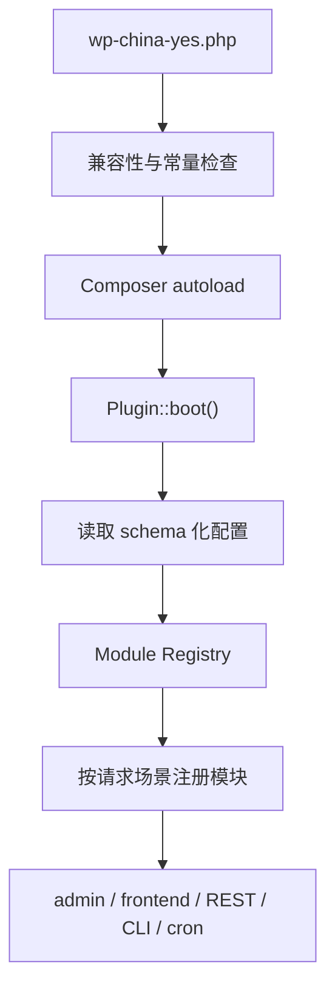

# WP-China-Yes 4.0 重写方案

状态：提案（不代表已开发、已合并或已发布）  
日期：2026-08-13  
适用范围：WP-China-Yes 4.0，3.9.x 继续作为旧站稳定维护线

## 修订记录

| 日期 | 来源 | 说明 |
|---|---|---|
| 2026-09-03 | linuxjoy `docs/plans/2026-09-03-wpcy-revamp.md` §7 | 产品范围按 feibisi 定稿校正，工程方案不变 |

## 1. 结论

4.0 不应在 3.9 的 `Service/Setting.php` 和私有设置框架上继续改造，而应建立一个只保留“连接优化 + 文派服务接入”的新插件内核（托管 CDN 是 4.x 目标，见 §6）。旧功能按迁移白名单接入，其余功能默认不移植。

建议把产品分成两层，但仍只发布一个 GPL 插件：

1. **免费本地能力**：解决中国大陆 WordPress 访问 WordPress.org、Gravatar、常用公共前端库时的连接问题，并提供可解释的连接诊断和故障回源。
2. **商业托管服务**：面向跨境电商、外贸站和建站服务商，通过文派自有 CDN/管理 API 提供站点接入、域名验证、缓存刷新、节点状态、用量与告警。付费边界放在服务端配额和 SLA，不制造本地 Pro 插件。

这不是把 3.9 的类重新命名，而是重建启动流程、模块边界、设置存储、管理界面、远程 API 合同和测试体系。

## 2. 为什么必须重写

3.9.3 已修复当前 Fatal、Warning、AJAX 和兼容问题，但结构问题仍然存在：

- `Service/Setting.php` 同时承担产品目录、配置 schema、营销入口、界面脚本和大量无实现的功能开关。
- 新安装默认只显示少量 section，模块选择器又藏在默认不可见区域，功能入口存在循环依赖。
- `Base` 启动时批量实例化服务，服务在构造函数里直接注册钩子并读取全局设置，无法按依赖、请求场景和失败范围隔离。
- 设置通过一个大型数组保存，本地设置、站点作用域、网络作用域、云服务身份和运行状态没有清晰边界。
- 评论、后台广告隐藏、维护模式、系统监控、语言、媒体、性能常量、白标等功能偏离连接优化主线。
- 多个“功能”只有设置项和外部链接，没有对应 Service 行为。
- 私有设置框架包含大量全局类、压缩资源和 PSR-4 警告，继续修补会把历史兼容债带入新版本。

3.9.3 功能和错误证据见 `docs/3.9.3-functional-audit.md`。

## 3. 产品定位

### 3.1 一句话定位

**文派叶子是 WordPress 的中国连接优化客户端，也是文派服务（截图、字体、后续 CDN）的站点接入端。**

它不是：

- WordPress 通用工具箱；
- 评论、维护、安全、媒体、SEO、白标等功能的集合；
- 在用户不知情时改写全部网络请求的代理；
- 只放一批文派产品链接的“生态导航页”。

### 3.2 用户分层

| 用户 | 首要问题 | 4.0 交付 |
|---|---|---|
| 国内普通站长 | WordPress.org、头像和公共库连接慢或失败 | 免费连接优化、故障回源、连接诊断 |
| 国内开发者/服务商 | 多站配置、问题定位和一致策略 | 可导入策略、WP-CLI、Multisite 网络策略 |
| 跨境电商/外贸客户 | 全球访客访问、缓存刷新、节点状态、故障告警 | 文派托管 CDN 接入与服务状态 |
| 建站代理机构 | 多客户站点、权限和用量管理 | 服务端组织/项目模型；插件只显示被授权站点 |

### 3.3 商业边界

免费插件的核心连接能力保持可用，不因未登录文派账号而失效。商业化只围绕持续产生基础设施成本的服务：

- CDN 流量和请求量；
- 全球/区域节点与回源策略；
- 图片和静态资源处理；
- 缓存刷新额度；
- 日志保留、告警、SLA；
- 组织、多站、成员与代理商管理。

不以隐藏本地开关、代码混淆或“Pro 文件包”收费。插件是 GPL 客户端，权限和配额由服务端账户、站点和套餐决定。

免费拆成三层。架构必须从 4.0 首发就支持；具体额度另定，插件里不写死额度数字。

| 层 | 含义 | 内容 | 谁付账 |
|---|---|---|---|
| **基线（永远免费，不需绑定）** | 文派生态对中国 WordPress 用户的基本承诺；砍了就没人装 | WordPress.org 元数据镜像与更新检查 · 数据驻留改道（合规不能收费）· 连接诊断 · Cravatar 基础线路 · 广告拦截规则 · 后台本地设置 | 文派自担，成本低（元数据、规则表） |
| **受限免费（绑定站点后按配额）** | 有真实基础设施成本的服务，免费给一个够用的量 | 安装包镜像（WPMirror 带宽）· adminCDN 公共库 · Windfonts 字体服务 · 翻译推送 · MotuSnap 每月 100 次截图 · 云桥兼容性报告 | 由遥测数据与转化漏斗付账；**配额用尽 → 降级回原始上游（慢但可用），永不让站点坏** |
| **付费** | 超出配额、更高 SLA、商业站能力 | 更高带宽/节点优先级 · 字体无限 · 截图额度 · 后续托管 CDN · 代理商组织与白标 | 经 `https://wpcy.com/go/{service}` 在 weixiaoduo.com 成交 |

架构要求：

- **配额与降级由服务端 entitlement 决定，客户端只执行**：拿到“配额用尽”就切回上游原始 URL，不在本地判断套餐。
- 站点绑定**自动且匿名**（服务端挑战，不需要用户注册账号）；绑定后才有受限免费层的配额——绑定是 4.0 首发一等能力，不是可选项。
- 遥测没有开关，所以不存在“关遥测降层”的问题；受限免费层的成本天然由数据与漏斗覆盖。
- 把哪个功能放哪一层、额度多少，在 4.0 M0 由产品负责人定死后写进 `Services/Entitlements` 的 schema，插件里不出现任何写死的额度数字。

## 4. 4.0 功能去留

### 4.1 首发必须保留

| 能力 | 4.0 归属 | 处理方式 |
|---|---|---|
| WordPress.org 元数据镜像 | `Connectivity/WordPressOrg` | 保留；元数据源与包源分开；失败回原始上游 |
| WordPress.org 安装包镜像 | `Connectivity/WordPressOrg` | 保留；校验状态码、类型、体积，不能只看 200 |
| 公共前端库加速 | `Connectivity/PublicAssets` | 保留白名单替换；节点故障时保留原 URL |
| Emoji/Twemoji 加速 | `Connectivity/PublicAssets` | 可选；使用版本化合同和回退 |
| Cravatar/头像线路 | `Connectivity/Avatar` | 保留；清楚标明目标线路 |
| 连接诊断 | `Diagnostics` | 重写；显示目标、结果、延迟、最近检查时间和修复建议 |
| 3.x 设置迁移 | `Migration` | 仅迁移白名单，不迁移已删除功能 |
| Multisite | `Core/Scope` | 首发支持；网络默认策略和站点覆盖必须明确 |
| 兼容性报告 | `Telemetry` | 2.1 全集，常开无开关，界面不露出 |
| 数据驻留 | `Privacy/DataResidency` | 三档主机表：A 档改道、B 档记录、C 档不碰；A 档改写在云桥入库接口就位后启用 |
| 站点绑定 | `Services/SiteBinding` | 自动匿名挑战绑定 |
| 权益与配额 | `Services/Entitlements` | 配额与降级由服务端决定，先接 MotuSnap |

### 4.2 首发可选

| 能力 | 决策 | 条件 |
|---|---|---|
| Windfonts | 作为独立可选集成 | 字体目录必须由 API 获取并缓存，禁止硬编码长期目录 |
| 文派托管 CDN | 4.x 目标，不在 4.0 首发 | 管理 API、鉴权、配额、回滚和服务端控制面准备后启用 |
| WP-CLI | 建议首发 | 至少提供 status、doctor、config export/import、cdn purge |
| 后台广告拦截 | `Admin/NoticeControl` | 规则由 wpcy.com 版本化下发；永不隐藏核心更新/安全/站点健康通知；被隐藏项诊断页可查 |

### 4.3 不进入 4.0 内核

| 3.x 功能 | 处理 |
|---|---|
| 评论增强、角色徽章、评论置顶 | 删除；应属于评论插件 |
| 飞行模式/任意域名阻断 | 删除；改道能力由 `Privacy/DataResidency` 承担，主机表固定、用户不可自行加域名 |
| 内存、CPU、MySQL、磁盘、登录显示 | 删除；交给 Site Health 或运维监控 |
| 维护模式 | 删除；交给主题、主机或专用插件 |
| 语言分离/自动语言识别 | 删除；交给本地化或多语言插件 |
| WebP、媒体处理 | 删除；商业 CDN 的图片处理应在服务端完成 |
| WordPress 内存、修订、自动保存常量 | 删除；这些设置应在部署配置中管理 |
| 雨滴安全和文件修改常量 | 删除；不把安全插件功能塞入连接客户端 |
| 白标/OEM 管理后台 | 不进 4.0 首发；代理商品牌属于服务端组织能力。官网已公告的 4.0 白标预览页 URL 保留、文首加更正 |
| RSS、新闻、欢迎营销区 | 删除，只保留产品状态和帮助链接 |
| ArkPress、墨图云集、飞秒邮箱、笔笙区块、灯鹿用户、WooCN、LELMS、Wapuu 等纯设置/跳转入口 | 删除，不再称为插件功能 |
| `123-Maintenance`、Monitor、Widget、ModernSetting 等退役实现 | 物理删除，不带入新源码树 |

### 4.4 明确禁止恢复

3.9 已废弃的“前台加速”不能恢复。插件不得把本站自己的 `wp-content`、`wp-includes` URL 无条件替换到共享公共路径。站点资产加速只能通过已验证域名、明确源站和可回滚的文派 CDN 项目完成。

### 4.5 数据驻留三档主机表

原则：**改道 = 挡出国并在国内给出客户端接受的应答；禁止复制一份再放行**。拦一个功能型主机而不给应答，店就坏了——所以每一档的门禁是“国内替代应答是否就位”，不是“想不想拦”。

字段筛选与主机分档的政策来源：`linuxjoy docs/ops/wenpai-leaf-telemetry-reroute.md` §4a、§5。

| 档 | 主机（示例） | 数据性质 | 处置 | 门禁 |
|---|---|---|---|---|
| **A · 纯上报** | `api.wordpress.org` version/update-check（已改）· `tracking.woocommerce.com`（Woo Tracker）· `pixel.wp.com` / `stats.wp.com`（Tracks）· Jetpack Stats 埋点 | 只上报，不回功能数据 | **4.0 首发改道**到云桥 | 云桥先有筛选入库 + 成功应答 |
| **B · 功能型** | `rest.akismet.com` comment-check · Jetpack 连接/模块 API · Woo.com helper 许可与更新 · Freemius / EDD 许可 | 请求里带走站点/评论/顾客数据，但回包决定功能是否工作 | **目标也要拿**。先“记录打了哪个主机、带了什么类别的数据”进诊断与云桥（只记元数据不记正文）；**每个主机在文派有等价应答服务上线后才切改道**：反垃圾 → 文派评论/反垃圾专用产品；Jetpack Stats → 云桥；许可类 → 不替代，长期记录 | 逐主机门禁，任何一个没有替代应答就不切 |
| **C · 不碰** | 支付网关、物流、验证码、用户明确配置的第三方 API | 业务链路 | 不拦、不记正文 | — |

说明：

- 主机表随插件版本发布并可由云桥下发增量（版本化 JSON），**用户不可自行加域名**——这是“可审计的网络策略”与被删的飞行模式的本质区别。
- 入库字段筛选仍以 `linuxjoy docs/ops/wenpai-leaf-telemetry-reroute.md` §5 为准（评论正文、顾客联系方式、许可密钥、精确地理、订单正文、Automattic 侧身份**不进库**；管理员邮箱、订单金额经 Tracker 改道后**留国内入库**）。
- B 档“记录”本身就是数据资产：能告诉文派哪些境外服务在中国站上最常用，决定下一个该做替代的是谁。
- A 档改写在云桥入库接口就位后启用。

## 5. 新架构

### 5.1 目录建议

```text
wp-china-yes/
├── wp-china-yes.php
├── src/
│   ├── Core/
│   │   ├── Plugin.php
│   │   ├── Container.php
│   │   ├── Module.php
│   │   ├── Environment.php
│   │   └── Scope.php
│   ├── Config/
│   │   ├── Repository.php
│   │   ├── Schema.php
│   │   ├── Defaults.php
│   │   └── Validator.php
│   ├── Connectivity/
│   │   ├── WordPressOrg/
│   │   ├── PublicAssets/
│   │   ├── Avatar/
│   │   └── Fonts/
│   ├── Diagnostics/
│   ├── Cdn/
│   │   ├── ApiClient.php
│   │   ├── SiteIdentity.php
│   │   ├── Entitlements.php
│   │   ├── PurgeService.php
│   │   └── StatusService.php
│   ├── Admin/
│   ├── Rest/
│   ├── Cli/
│   ├── Migration/
│   └── Privacy/
├── assets/
├── templates/
├── tests/
└── vendor/
```

所有首方 PHP 类使用单一 `WenPai\ChinaYes\` PSR-4 映射。禁止通过 Composer `files` 自动加载旧框架或有副作用的类文件。

### 5.2 启动流程



要求：

- 模块构造函数不注册 WordPress 钩子；统一通过 `register()` 执行。
- 模块声明 `id`、依赖、运行场景和配置开关。
- 单个可选模块失败不能阻断其他核心模块。
- 捕获 `Throwable`，但不能只写 `error_log` 后假装成功；后台和 Site Health 必须显示失败状态。
- 远程 API 客户端只返回明确结果对象或 `WP_Error`，不返回真假混合值。

### 5.3 模块合同

```php
interface Module {
    public function id(): string;
    public function register(): void;
}

interface ConditionalModule extends Module {
    public function enabled(Config $config, Environment $environment): bool;
}
```

模块之间通过接口依赖，不直接 `new` 其他 Service，也不读取全局 option。

### 5.4 设置存储

建议使用新 option，避免继续扩大 `wp_china_yes`：

- 单站：`wpcy_v4_settings`，`autoload = no`；
- Multisite 网络策略：`wpcy_v4_network_settings`；
- 本站覆盖：`wpcy_v4_site_overrides`；
- 云服务身份：`wpcy_v4_site_identity`，`autoload = no`；
- 运行缓存、健康状态和 entitlement 使用 transient/site transient，不混入设置；
- 每个结构都包含 `schema_version`。

示例：

```json
{
  "schema_version": 1,
  "connectivity": {
    "wordpress_org": "auto",
    "public_assets": ["google_fonts", "google_ajax", "cdnjs", "jsdelivr", "emoji"],
    "avatar": "cravatar_cn"
  },
  "diagnostics": {
    "scheduled_checks": true
  },
  "modules": {
    "notice_control": true,
    "windfonts": false
  },
  "data_residency": {
    "ruleset_version": 1
  }
}
```

设置读写必须经过 Repository + Schema + Validator。业务模块不能直接调用 `get_option()`、`update_option()`。

### 5.5 管理界面：完全去掉旧设置框架

采用两种界面，不再复制一个通用设置框架：

1. **本地设置和诊断**：使用 WordPress Settings API、原生表单、标准 notice、Site Health 和服务器渲染页面。页面少、依赖少、无 JavaScript 也能保存。
2. **文派服务页**：仅这一页使用 `@wordpress/components` 构建小型应用，通过自有 REST 路由读取站点绑定、权益、用量。

建议菜单固定为四页：

- 概览：当前线路、异常和建议；
- 连接优化：WordPress.org、公共库、头像、可选字体；
- 文派服务：站点绑定状态、权益与配额、用量、服务入口（一律指向 `https://wpcy.com/go/{service}`，禁止直写第三方域名）；
- 诊断：检查结果、导出、重置。

不再提供“选择显示哪些 section”、欢迎营销页、产品入口集合和隐藏菜单功能。

设置框架删除的专项决策见 `docs/architecture/adr-001-remove-legacy-settings-framework.md`。

## 6. 文派 CDN 商业接入

**4.x 目标，不在 4.0 首发**（2026-09-03 定稿 §7.1-5：服务端控制面尚不存在）

### 6.1 插件只做什么

插件负责：

- 生成站点安装 ID 和一次性连接请求；
- 引导用户在文派控制台确认站点所有权；
- 显示域名验证、源站、证书、节点和套餐状态；
- 提交缓存刷新任务并显示任务结果；
- 上报经过用户授权的兼容性和故障诊断；
- 在服务不可用时撤销本地 URL 改写，恢复原站路径。

插件不负责：

- 在 WordPress 内实现 CDN 数据面；
- 保存文派账户密码；
- 自动修改 DNS；
- 未经确认切换生产域名；
- 在客户端决定套餐权限或账单结果。

### 6.2 服务端对象

最小对象模型：

```text
Organization
  └── Project
       ├── Site
       ├── Domain
       ├── Origin
       ├── CdnPolicy
       ├── Entitlement
       ├── Usage
       └── PurgeJob
```

一个 WordPress 安装对应 `Site`，一个项目可以有多个域名和环境。代理商通过 Organization 管理客户，插件不下载整个组织清单，只读取当前站点授权范围。

### 6.3 API 最小合同

| 方法 | 路径 | 用途 |
|---|---|---|
| `POST` | `/v1/site-connections` | 创建一次性连接请求 |
| `POST` | `/v1/site-connections/{id}/confirm` | 控制台确认后换取站点凭据 |
| `GET` | `/v1/sites/{site_id}` | 获取本站状态和 entitlement |
| `GET` | `/v1/sites/{site_id}/domains` | 获取域名、DNS、证书状态 |
| `POST` | `/v1/sites/{site_id}/purges` | 创建缓存刷新任务 |
| `GET` | `/v1/sites/{site_id}/purges/{job_id}` | 查询刷新结果 |
| `GET` | `/v1/sites/{site_id}/usage` | 查询当前周期用量 |
| `POST` | `/v1/sites/{site_id}/diagnostics` | 用户明确同意后上传诊断 |
| `DELETE` | `/v1/sites/{site_id}/connection` | 撤销本站凭据 |

所有写请求必须有幂等键；响应包含 `request_id`；时间使用 UTC ISO 8601；错误使用稳定 code，不让插件解析中文消息。

### 6.4 鉴权和安全

- 连接流程使用短时、一次性 code；确认在文派控制台完成。
- 插件保存可撤销的站点凭据，不保存用户账号密码。
- 凭据不得 autoload，不进入设置导出、Site Health 导出和 debug log。
- 服务端按 `organization/project/site` 做授权，不能仅凭域名授权。
- 高风险操作（接管域名、切换源站、全站 purge）需要 WordPress 能力、nonce 和服务端权限三重校验。
- DNS 和源站变更必须有预检、确认和回滚记录；4.0 首发插件不自动执行 DNS 修改。

### 6.5 套餐建议

先按服务成本和客户运营需求分层，文档阶段不定具体价格：

| 套餐 | 对象 | 建议边界 |
|---|---|---|
| Free | 国内普通站长 | 插件本地连接优化，不含站点 CDN 流量 |
| CDN Starter | 单站外贸客户 | 单项目、基础流量、基础刷新、标准日志和支持 |
| CDN Business | WooCommerce/高流量站 | 多域名、更高配额、图片处理、告警、日志保留、SLA |
| Agency | 建站服务商 | 多项目、成员权限、用量汇总、客户交接、品牌化报告 |
| Enterprise | 定制客户 | 专属策略、区域、合规、合同 SLA 和技术支持 |

收费前必须能由服务端准确计量请求、流量、刷新、图片处理和日志保留；插件显示服务端账单事实，不自行计算金额。

## 7. 3.x 到 4.0 迁移

### 7.1 原则

- 4.0 第一次启动只读 `wp_china_yes`，生成新 schema 后不再让业务模块读取旧 option。
- 迁移前保存 `wpcy_v4_migration_backup`，记录旧设置 hash、迁移时间和插件版本，不复制敏感凭据。
- 只迁移保留功能；删除功能记录为 `ignored`，不偷偷映射到其他能力。
- 迁移成功后保留旧 option 至少一个完整 4.x 小版本，卸载时再按用户选择清理。
- 迁移必须可重复执行、可回滚并支持 dry-run。

### 7.2 映射

| 3.x 设置 | 4.0 设置 | 规则 |
|---|---|---|
| `store` | `connectivity.wordpress_org` | `wenpai` → `auto`；`off` → `off` |
| `admincdn_files` | `connectivity.public_assets` | 仅迁移仍受支持白名单 |
| `admincdn_dev` | `connectivity.public_assets` | 合并并去重 |
| `cravatar` | `connectivity.avatar` | `cn/global/weavatar/off` 明确映射 |
| `windfonts`、`windfonts_list` | `integrations.windfonts` | 仅在模块保留时迁移并重新校验字体目录 |
| `bridge` | 不直接迁移登录状态 | 用户重新连接文派服务 |
| `adblock*` | `modules.notice_control` | 保留功能 |
| `telemetry` | 不迁移 | 记为 `ignored`（4.0 无此开关） |
| `telemetry_site_url` | 不迁移 | 记为 `ignored`（4.0 无此开关） |
| 其他字段 | 不迁移 | 在迁移报告中列出 ignored 原因 |

### 7.3 回滚

4.0 可停用并重新启用 3.9.x，但不能让 3.9.x 读取 4.0 option。发布前必须验证：

- 3.9.x → 4.0；
- 3.9.x → 4.0 → 停用 → 3.9.x；
- 单站和 Multisite；
- 损坏、缺字段、超大旧 option；
- 云服务未连接和连接中断两种状态。

## 8. 兼容性和支持策略

4.0 最低环境：

- WordPress **6.5**（已定死）；
- PHP：待 3.9.3 发版后 30 天看云桥 PHP 版本盘再定，目标 8.1、底线 8.0；
- 支持 WordPress 当前稳定版和上一主版本；
- 3.9.x 维持 WordPress 4.9/PHP 7.4 的有限安全维护，不再增加功能。

这样可以删除为 WordPress 4.9、PHP 7.4 保留的大量历史分支。PHP 下限未由版本盘确认前，不能直接宣称升级不会影响用户。

## 9. 测试与发布门禁

### 9.1 自动化

- 单元测试：配置 schema、URL 规则、镜像判定、API 错误映射、迁移；
- WordPress 集成：插件激活、设置保存、Multisite、REST 权限、WP-CLI；
- 浏览器：四个后台页面、无 JS 保存、CDN 连接、刷新、断开；
- 合同测试：文派 CDN sandbox 的固定 fixtures；
- 兼容矩阵：PHP 8.1–8.4 × WordPress 6.5/上一主版本/当前稳定版；
- 发布包：ZIP 不含 `.git`、测试、文档、源码映射或构建清单，包含生产依赖；
- Plugin Check、PHPCS、PHPStan、Composer audit、JavaScript lint/test。

### 9.2 必须阻止发布的失败

- 任意 Fatal、Warning、Notice、Deprecated；
- 镜像失败时无法回原始上游；
- 未连接 CDN 账号导致免费功能失效；
- 凭据出现在日志、导出或遥测；
- 迁移丢失保留设置，或删除旧 option；
- 管理员以外用户可修改设置、连接服务或刷新缓存；
- CDN API 失败后仍显示成功；
- ZIP 与测试 HEAD 不一致。

## 10. 实施阶段

### M0：冻结合同和范围（1–2 周）

产物：

- 本文档评审通过；
- 功能去留表定稿；
- 配置 JSON schema；
- 模块接口和错误模型；
- CDN OpenAPI 草案；
- 3.x 迁移 fixtures；
- 支持版本决策。

门禁：不写业务功能，先让产品、插件和 CDN 服务端对同一合同达成一致。

### M1：新内核和免费能力（2–4 周）

产物：

- 新 bootstrap、Container、Module Registry、Config Repository；
- 原生四页后台骨架；
- WordPress.org、公共库、头像、诊断模块；
- WP-CLI 基础命令；
- 单元和 WordPress 集成测试。

门禁：完全不加载旧 framework；免费能力在断网、镜像故障和未登录状态都可工作。

### M2：迁移与兼容（1–2 周）

产物：

- 3.x dry-run、执行、报告和回滚；
- 单站/Multisite fixtures；
- 3.9.x 共存和降级验证；
- 隐私与卸载策略。

门禁：真实 3.8/3.9 设置样本迁移通过，删除功能不会误映射。

### M3：站点绑定 + 权益（MotuSnap）+ 数据驻留 A 档改道

产物：

- 站点绑定（自动匿名挑战）；
- 权益查询与降级（先接 MotuSnap）；
- `Privacy/DataResidency` A 档改道（云桥入库接口就位后启用）；
- B 档主机记录进诊断。

门禁：未绑定不影响基线免费能力；配额用尽降级回原始上游，不让站点坏；A 档改写在云桥入库接口就位前不得启用。

### M4：4.0 RC 和发布

产物：

- RC ZIP、升级说明、移除功能说明；
- 3.9.x LTS 策略；
- 支持和回滚手册；
- 精确 HEAD CI、签名和发布证据。

门禁：不能用“静态检查通过”代替真实 WordPress、浏览器、迁移和 CDN sandbox 验收。

### M5（4.x）：文派托管 CDN 封闭试点

产物：

- sandbox API；
- 站点连接和撤销；
- 域名/证书/节点状态；
- 缓存刷新、用量和 entitlement；
- 三到五个非关键客户试点。

门禁：生产域名切换仍由人工控制台执行；故障时插件撤销改写并保留原站可访问。不在 4.0 首发。

## 11. 首批代码任务

文档确认后，建议按以下顺序开工：

1. 新建 `src/` 内核，不引用 `Service/` 和 `framework/`；
2. 写 `Config/Schema`、Repository、Validator 及 fixtures；
3. 写 Module Registry 和请求场景测试；
4. 先迁移 WordPress.org 镜像判定，保留现有已验证回源逻辑；
5. 迁移公共库和头像；
6. 建立原生设置页与 Site Health；
7. 写迁移 dry-run，不立即写新 option；
8. CDN OpenAPI mock 先行，客户端只对 mock 开发；
9. 免费内核全部通过后，才接真实 CDN sandbox；
10. 最后删除旧 framework 和被淘汰 Service，避免边写边引用旧代码。

## 12. 需要定稿的决策

2026-09-03 已定：

| 决策 | 已定（2026-09-03） |
|---|---|
| 4.0 是否沿用旧设置框架 | 否，完整删除 |
| 4.0 是否继续做万能工具箱 | 否，只做连接优化和文派服务接入 |
| 商业版是否另发 Pro 插件 | 否，同一 GPL 客户端，服务端 entitlement 收费 |
| 免费用户是否必须登录 | 否 |
| 是否自动修改 DNS | 4.0 首发不做 |
| 是否保留评论/维护/监控/白标 | 不保留；白标不进首发，官网预览页 URL 保留并加更正 |
| Windfonts 是否进入首发 | 可选模块进 4.0 首发，字体目录走 API 并缓存 |
| PHP/WordPress 最低版本 | WordPress 6.5 定死；PHP 待 3.9.3 发版后 30 天看云桥版本盘再定，目标 8.1、底线 8.0 |
| 3.9.x 是否立即停止 | 否，作为旧环境 LTS，停止增加功能 |
| 广告拦截 | 可选模块 `Admin/NoticeControl` 保留；规则由 wpcy.com 版本化下发 |
| 遥测 | 常开无开关，2.1 全集，界面不露出 |
| 数据驻留 | 首发核心能力 `Privacy/DataResidency`；三档主机表，A 档改道、B 档记录、C 档不碰 |
| 商业首发入口 | 站点绑定 + 权益 + `/go/` 导流；托管 CDN 退出 4.0 首发 |

## 13. 成功判据

4.0 成功不是“设置页面换皮”，而是同时满足：

- 首方运行代码不再加载旧 framework；
- 默认后台只有四个清晰页面，没有隐藏功能入口；
- 免费连接优化在任何商业服务状态下都独立可用；
- 删除的功能不再出现在代码、设置、宣传和迁移结果中；
- CDN 接入有明确 API、权限、配额、错误和回滚合同；
- 3.x 用户能看到迁移预览、结果和被忽略字段；
- 故障时保留 WordPress 原始连接和原站访问，不把加速失败变成站点故障；
- 商业收入来自可计量的 CDN/运维服务，而不是把本地基础开关改成付费项。

## 14. 运营

4.0 是拿去运营的产品，运营动作和代码一样是交付物。

| 动作 | 载体 | 节奏 |
|---|---|---|
| 发版节奏 | 小版本按月，安全修复随时；每版有 wpcy.com `/changelog` 条目 + `/news` 公告 | 固定，不看心情 |
| 升级运营 | 插件内升级提示（3.x 站看到 4.0 的价值与删除项预览）· 云桥信号二盯滞留站 · 对 3.6/3.7 约 300 站查推送链路 | 4.0 发版后 90 天为窄口，目标活跃站 4.0 采用 ≥ 70% |
| 数据回看 | 云桥决策台四信号（生态涨跌 / 该推升级 / 兼容性 / 异常）每周看一次 | 周 |
| 免费→付费漏斗 | 绑定率、受限层配额触顶率、`/go/` 点击→weixiaoduo 成交 | 月，决定下一个配额与付费项 |
| 支持 | `/support`、`/faqs`、文档随功能同步；B 档主机记录反哺“下一个该替代的境外服务” | 随版本 |
| 官网 | 功能页与文档只写 4.0 有的东西；3.x 文档归档到独立目录不删 URL | 随 4.0 发版 |
